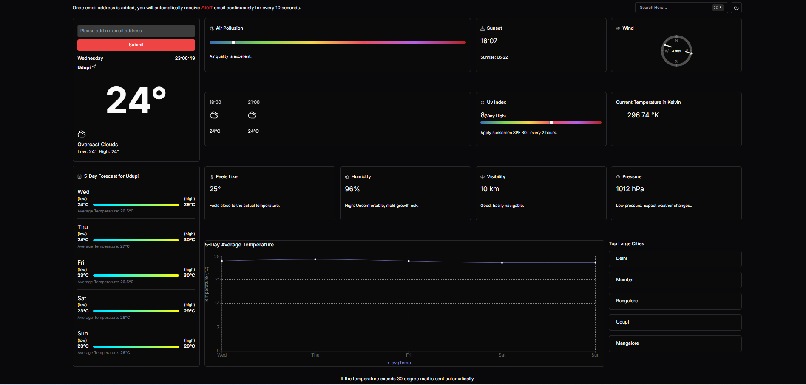

# Weather Dashboard



## Overview

This project is a **Weather Dashboard** designed to display real-time weather conditions for a specific location. The dashboard provides various weather metrics, including temperature, humidity, air pollution, UV index, and other relevant data. It also includes a 5-day weather forecast and updates in real-time, offering users continuous monitoring of weather conditions.

You can check out the live project here: **[Weather Dashboard](https://zeotap-assignment.vercel.app/)**

## Features

- **Real-Time Weather Display:** Shows the current temperature, weather condition (e.g., overcast clouds), humidity, and atmospheric pressure for a specific location (e.g., Udupi).
- **Air Pollution Levels:** Monitors and displays the current air pollution index, indicating the quality of air.
- **5-Day Forecast:** Provides a visual breakdown of the weather forecast for the next five days, including high/low temperatures and average temperature for each day.
- **Sunset and Sunrise Information:** Displays the exact times for sunset and sunrise for the selected location.
- **Wind Speed and Direction:** Displays real-time wind speed (in meters per second) and direction.
- **Feels Like Temperature:** Shows the "feels like" temperature, taking into account humidity and other factors to give a more accurate sense of how the weather feels.
- **UV Index:** Displays the UV index, along with recommendations (e.g., applying sunscreen for values above 30).
- **Pressure and Visibility:** Provides information on atmospheric pressure and visibility conditions.
- **Temperature Alerts:** The system sends an alert email automatically if the temperature exceeds 30°C. Alerts are sent every 10 seconds to notify users when this condition is met.
- **Kelvin Temperature Display:** For scientific purposes, the dashboard shows the current temperature in Kelvin.
- **Location Selector:** Allows users to view weather data for major cities, including Delhi, Mumbai, Bangalore, Udupi, and Mangalore.
- **5-Day Average Temperature Graph:** A graphical representation of the average temperature trend over the next five days is provided.
- **Continuous Alert Feature:** If the temperature exceeds 30°C, the system will automatically send an alert email continuously every 10 seconds.

## Tech Stack

- **Frontend:**
  - **Next.js:** Framework for server-side rendering and static site generation.
  - **Tailwind CSS:** Utility-first CSS framework for building responsive designs quickly and efficiently.
  - **TypeScript:** Used for strong type-checking in the frontend code to improve code quality and reduce bugs.

- **Backend Operations:**
  - **Node.js:** JavaScript runtime used to handle backend operations such as sending temperature alerts via email.
  - **NodeMailer:** Used for sending temperature alert emails automatically when certain conditions are met.

- **Database:**
  - **MongoDB:** NoSQL database used for storing weather data, user preferences, and email alert configurations.

## How It Works

- **Weather API Integration:** The dashboard pulls real-time weather data from OpenWeatherMap using the API key provided in the environment variables, updating the weather conditions based on the selected city.
- **Real-Time Updates:** The application automatically refreshes at regular intervals, ensuring that users have the most up-to-date weather data.
- **Temperature Alerts via Email:** Users can input their email address, and the system will send temperature alerts every 10 seconds if the temperature exceeds 30°C.
- **Graphical Representation:** The dashboard includes visual elements, such as a graph displaying the 5-day average temperature, providing a better understanding of temperature trends over time.

## Getting Started

### Prerequisites

Make sure you have the following installed:

- **Node.js** (v14 or above)
- **MongoDB** (local or cloud-based instance)

### Installation

1. Clone the repository:
   ```bash
   git clone https://github.com/PRATHVIRAJ67/Zeotap-Assignment.git
   cd Zeotap-Assignment
   ```

2. Install dependencies:
   ```bash
   npm install
   ```

3. Set up environment variables:
   Create a `.env` file and include the following variables with your own keys and credentials:
   ```bash
   OPENWEATHERMAP_API_KEY=your_openweathermap_api_key
   MONGODB_URI=your_mongodb_uri
   EMAIL_USER=your_email_address
   EMAIL_PASS=your_email_password
   ```

4. Start the development server:
   ```bash
   npm run dev
   ```

5. Navigate to `http://localhost:3000` to view the dashboard.

## Usage

1. **Add an email address** on the dashboard to receive temperature alerts.
2. **Monitor real-time weather metrics** such as temperature, humidity, air pollution, and UV index.
3. **Use the 5-day forecast** to plan for upcoming weather conditions.
4. **Receive email alerts** continuously if the temperature exceeds 30°C.
